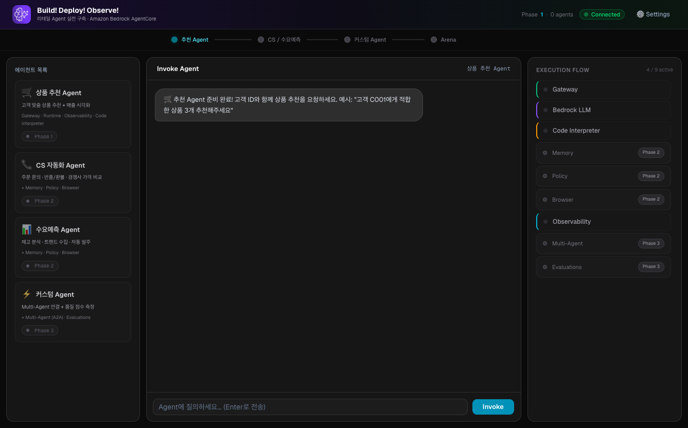

# 🚀 Agent Playground — Build! Deploy! Observe!

**Amazon Bedrock AgentCore Workshop** 참가자용 Agent 체험 UI



## 개요

워크샵 참가자가 Phase별로 배포한 AgentCore Agent를 **시각적으로 호출하고, 내부 동작 원리를 실시간으로 확인**할 수 있는 대시보드입니다.

### 핵심 기능

| 기능 | 설명 |
|------|------|
| **Agent 채팅** | 배포한 Agent에 자연어로 질문 → SSE 실시간 스트리밍 응답 |
| **AgentCore Services 패널** | 이번 호출에서 실제로 사용된 서비스와 호출 내용을 카드에 표시 (LIVE/MOCK 구분) |
| **Phase Progress** | 워크샵 진행 상황 시각화 (추천 → CS/수요 → 커스텀) |
| **Agent 카드** | Phase별 Agent 상태 (ACTIVE/LOCKED), ARN 등록 시 자동 활성화 |
| **Settings** | Agent별 ARN 입력 → localStorage 저장 → 즉시 연결 |

---

## 아키텍처

이 앱은 **Workshop Studio가 CloudFormation으로 참가자 계정에 자동 배포**합니다.
참가자는 CloudFront HTTPS URL 접속만 하면 되고, 추가 설정이 없습니다.

```
참가자 브라우저
   │  HTTPS
   ▼
┌──────────────────────────────────────────────┐
│  CloudFront  (Workshop Studio CFN이 생성)       │
└──────────────────────────────────────────────┘
   │  http origin (port 3000만 노출)
   ▼
┌──────────────────────────────────────────────┐
│  EC2 (t3.large, Amazon Linux 2023)             │
│                                                 │
│  ┌───────────────────────┐  /api/* rewrites    │
│  │ Next.js (:3000)        │ ──────────────┐     │
│  │  프론트 + 프록시         │               │     │
│  └───────────────────────┘               ▼     │
│                          ┌───────────────────┐ │
│                          │ Flask (:5050)      │ │  로컬 전용
│                          │  AgentCore invoke   │ │  (SG/CloudFront 미노출)
│                          └───────────────────┘ │
│                                   │ boto3        │
└───────────────────────────────────┼─────────────┘
                                     ▼
              AgentCore Runtime (us-west-2)
              → Gateway / Memory / Browser / Lambda Tools ...
```

> **프론트↔백엔드 연결 (중요)**
> Flask 백엔드(5050)는 EC2 로컬에만 뜨고 CloudFront/Security Group에 노출되지 않습니다.
> 브라우저는 같은 오리진의 상대경로 `/api/*` 로 호출하고, **Next.js의 `rewrites`가
> 이를 로컬 Flask로 프록시**합니다. 덕분에 mixed-content/CORS/포트 개방이 필요 없습니다.
> (`next.config.ts` 참고. 프록시 목적지는 `API_ORIGIN` 환경변수로 오버라이드 가능하며 `next build` 시점에 결정됩니다.)

### 참가자 경험
1. Code Editor에서 Agent 코드 작성 + deploy → Agent ARN 확보
2. Agent Playground **Settings**에서 ARN 입력
3. 채팅으로 Agent 호출 → AgentCore Services 패널에서 실제 사용 서비스 확인
4. Phase 진행할수록 사용 가능한 서비스가 늘어남

---

## 기술 스택

| Layer | Technology |
|-------|-----------|
| Frontend | Next.js 16 (App Router, Turbopack) + React 19 + TypeScript |
| Styling | Tailwind CSS v4 |
| UI Components | shadcn/ui (`@base-ui/react`) + Framer Motion |
| Markdown | react-markdown + remark-gfm |
| Backend | Flask + flask-cors (Python) + boto3 |
| Agent 호출 | AWS Bedrock AgentCore Runtime API (`invoke_agent_runtime`, SSE) |
| 디자인 | Dark theme + Glassmorphism + Cyan/Purple accent |

---

## 로컬 실행 (개발용)

```bash
# 1. 백엔드 (Flask) — 별도 터미널
cd api
pip install -r requirements.txt
export AWS_REGION=us-west-2      # AgentCore Runtime이 배포된 리전
python3 app.py                   # → http://localhost:5050

# 2. 프론트엔드 (Next.js)
npm install
npm run dev                      # → http://localhost:3000
```

- 개발 모드(`next dev`)에서도 `/api/*` 프록시가 동작하므로, 브라우저는 `http://localhost:3000` 하나만 열면 됩니다.
- 프록시 목적지를 바꾸려면: `API_ORIGIN=http://127.0.0.1:5050 npm run build`

### 검증

```bash
npx tsc --noEmit    # 타입 체크
npx eslint .        # 린트
npm run build       # 프로덕션 빌드
```

---

## EC2 배포 (워크샵용)

배포는 **Workshop Studio의 CloudFormation 템플릿**(워크샵 콘텐츠 repo의
`static/workshop-resources.yaml`)이 담당합니다. 이 repo를 직접 배포할 필요는 없습니다.

CloudFormation이 하는 일:
- EC2 2대 생성 — **code-server(:8888)** + **agent-playground(:3000)**, 각각 CloudFront 뒤에 배치
- 각 Security Group은 CloudFront origin-facing prefix list에서 해당 포트만 개방
- Playground EC2의 UserData가 이 repo를 clone → `npm run build` →
  **systemd 서비스 2개**(`playground-api` = Flask:5050, `playground-web` = Next.js:3000)로 기동
- Mock 경쟁사 사이트(S3 + CloudFront OAC), Lambda Tool 함수들, AgentCore용 IAM Role 생성

### CloudFormation 주요 Output
| Output | 설명 |
|--------|------|
| `PlaygroundUrl` | Agent Playground 접속 URL (HTTPS, CloudFront) |
| `CodeServerUrl` / `CodeServerPassword` | VS Code Server 접속 |
| `MockSiteUrl` | Browser Tool용 Mock 경쟁사 가격 사이트 |
| `RuntimeRoleArn` / `GatewayRoleArn` | AgentCore Runtime / Gateway IAM Role |

> 참가자에게 반영하려면 이 repo가 **GitHub `main`에 push**되어 있어야 합니다.
> (UserData가 `git clone` 하기 때문)

---

## 사용법 (참가자)

### 1. Agent 등록
- 우측 상단 **Settings** 클릭
- Phase별 Agent ARN 입력 (deploy 후 출력되는 ARN 복사)
- 저장 → 해당 Agent 카드 자동 활성화 (ARN은 localStorage에 저장됨)

### 2. Agent 호출
- 활성화된 Agent 카드 클릭
- 채팅 입력란에 질문 입력 + Enter (또는 preset 질문 칩 클릭)
- 응답이 SSE 스트리밍으로 표시됨

### 3. AgentCore Services 관찰
- 우측 패널에서 이번 호출에 실제 사용된 서비스와 호출 내용 확인
- ARN이 설정돼 실제 호출된 경우 **● LIVE**, 예시 시나리오는 **○ MOCK** 배지로 구분
- 응답 본문 키워드로 사용 Tool을 역추정 (Runtime API가 중간 이벤트를 제공하지 않아 완전 실시간은 아님)

---

## Phase별 Agent & 활성화 서비스

| Phase | Agent | 사용 서비스 |
|-------|-------|-----------|
| Phase 1 | 상품 추천 Agent | Gateway · Bedrock LLM · Observability |
| Phase 2 | CS 자동화 Agent (주문·반품·경쟁사 가격 비교) | + Memory · Policy · Browser |
| Phase 2 | 수요예측 Agent (재고·트렌드·자동 발주) | + Memory · Policy · Browser |
| Phase 3 | 커스텀 Agent | + Multi-Agent (A2A) · Evaluations |

정의된 AgentCore 서비스 (총 8개): `gateway`, `llm`, `memory`, `policy`, `browser`, `observability`, `multi-agent`, `evaluations`

---

## 프로젝트 구조

```
rcg-agent-playground/
├── src/
│   ├── app/
│   │   ├── page.tsx              # 메인 페이지 (Agent별 대화/로그/통계 상태 관리)
│   │   ├── layout.tsx            # 루트 레이아웃
│   │   └── globals.css           # 다크 테마 + 애니메이션
│   ├── components/
│   │   ├── agent-sidebar.tsx     # 좌측 Agent 카드 (Active/Locked)
│   │   ├── chat-panel.tsx        # 중앙 채팅 (스트리밍, 생각중 체크리스트)
│   │   ├── execution-flow.tsx    # 우측 AgentCore Services 패널
│   │   ├── metrics-bar.tsx       # 상단 메트릭 (invocations / latency / success)
│   │   ├── settings-modal.tsx    # Agent별 ARN 설정 모달
│   │   └── ui/                   # shadcn/ui 프리미티브
│   └── lib/
│       ├── agentcore-services.ts # 8개 서비스 정의 + mock 시나리오
│       ├── api.ts                # Flask API 클라이언트 (health/invoke-stream/validate)
│       ├── types.ts              # TypeScript 타입
│       └── utils.ts
├── api/
│   ├── app.py                    # Flask 백엔드 (SSE 스트리밍 invoke)
│   └── requirements.txt
├── next.config.ts                # /api/* → 로컬 Flask rewrites 프록시
├── public/                       # agentcore-icon.png, 로고 등
└── package.json
```

### Backend API 엔드포인트 (`api/app.py`)
| Method | Path | 설명 |
|--------|------|------|
| GET | `/api/health` | STS로 계정/리전 연결 상태 확인 |
| POST | `/api/invoke-stream` | AgentCore Runtime 호출 → SSE 스트리밍 |
| POST | `/api/agents/validate` | Agent ARN 유효성 검사 |

---

## Related Repositories

- [rcg-agentcore-workshop](https://github.com/kjhyuok/rcg-agentcore-workshop) — 워크샵 코드 (Lambda, Agent, Scripts)
- [rcg-agentcore-workshop-guide](https://github.com/kjhyuok/rcg-agentcore-workshop-guide) — 워크샵 가이드
